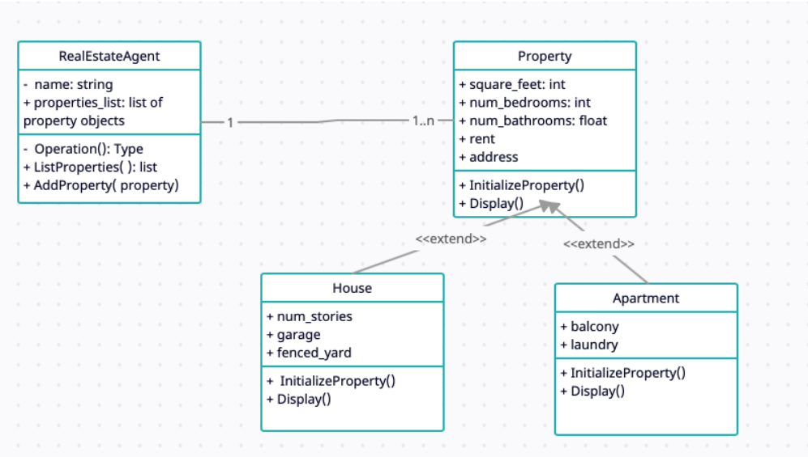

# Real Estate Agency Object Inheritance
This code will be expanded on in [another repository](https://github.com/jesuszeno2/Real-Estate-Agency-Object-Inheritance-With-Abstract-Classes) using abstract classes and multiple inheritance. 

This application (main) creates 2 agents objects. Next, I create 3 different types of
properties (2 houses, 1 apartment) and distribute them among the 2 agents. Third, I iterate through the list
of agents (objects) and print every agent’s properties, listing the property type , rent, and address. This was done as an assignment for one of my classes.

Refer to the UML diagram below for a better undestanding of the python files:

